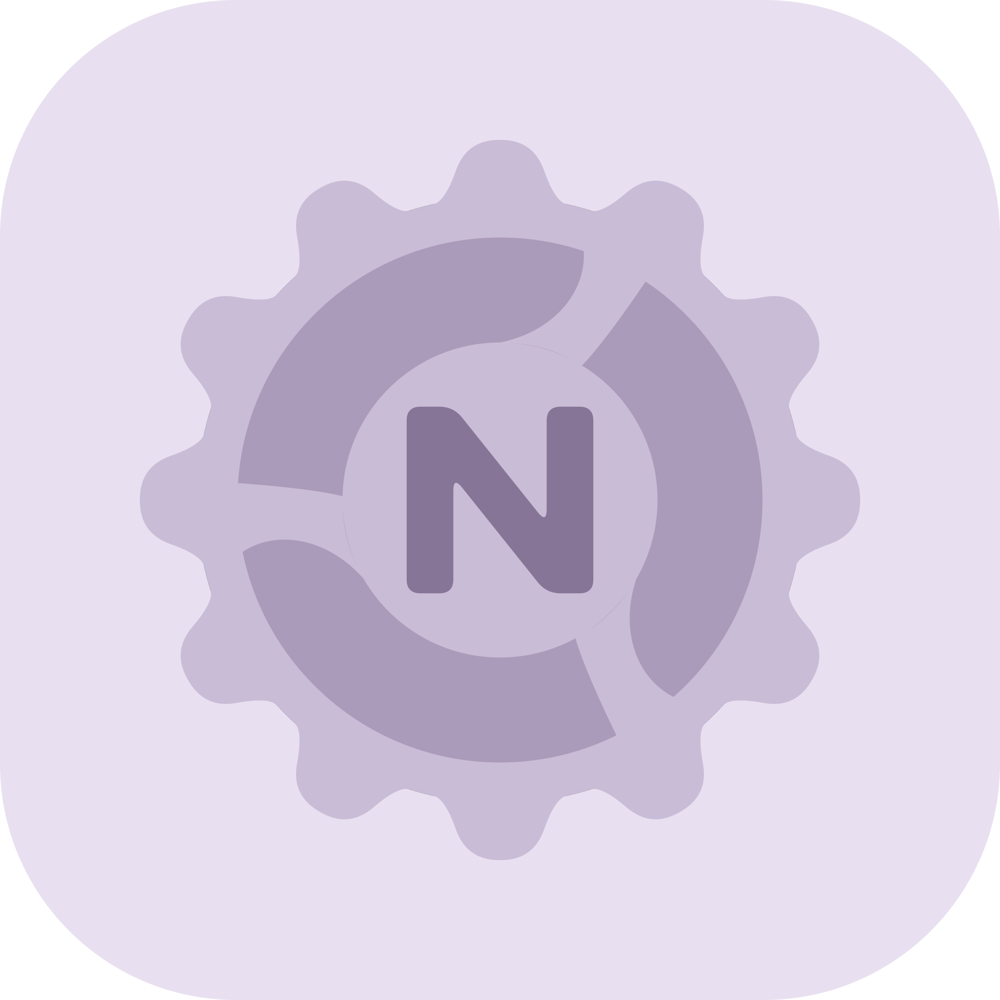

<div align="center">



# ONextBox

**简体中文 · [繁體中文](README.zh-TW.md) · [English](README.en.md)**

### 🧩 让 ColorOS，多一点可能。

ONextBox 是一款基于 Root 与 Modern Xposed 的 ColorOS 系统优化与扩展工具箱，让系统定制更自由，让日常体验更顺手。


[](LICENSE)

**[📥 下载](https://github.com/MiToverG422/ONextBox/releases) · [🐛 问题反馈](https://github.com/MiToverG422/ONextBox/issues) · [💬 Telegram](https://t.me/ONextBox)**

**[🚀 正式发布](https://t.me/ONextBox/2) · [🧪 测试构建 / CI](https://t.me/ONextBox/4)**

[✨ 功能](#features) · [📱 兼容性](#compatibility) · [🔨 构建](#building) · [📚 引用与致谢](#credits)

</div>

---

> [!WARNING]
> 项目仍在持续开发与适配中。系统级修改可能影响稳定性，不同机型、系统版本和区域版本的表现也可能不同。请先备份重要数据，再按需开启功能，不建议一次性打开所有选项。

## 🌿 关于项目

ONextBox 是由 **MiToverG422 主导开发与维护** 的个人项目。项目方向、功能取舍、界面设计、适配与实机验证均由作者主导；ChatGPT / Codex 只是辅助工具，用于部分代码编写、问题分析与迭代，不替代作者的判断与投入。最终的开发决策与项目维护由作者负责。

**如果你不接受 AI 辅助开发的项目，可以选择不使用，彼此尊重即可。** 项目会如实说明工具的使用，不回避，也不把它当作质量保证。

也希望大家更多关注实际体验、代码质量和问题是否得到解决。使用 AI 辅助，不意味着作品天然粗糙，更不意味着作者没有付出；同样，使用 AI 也不代表作品自动可靠。欢迎指出具体问题、提出改进建议，而不是仅凭一个「AI 辅助」标签否定整个项目。

欢迎有复现步骤的反馈，也欢迎代码、翻译与设计贡献。让作品靠体验和改进说话。💜

**官方版本免费提供，不存在付费授权、二次收费或付费激活。** 请认准项目链接，警惕冒充官方的收费版本。

<a id="features"></a>

## ✨ 不止一个开关

### 🎨 两种界面，一份工具箱

| 界面风格 | 体验方向 |
| --- | --- |
| **COUI 17.0** | 以 ColorOS 风格为方向，提供圆润卡片、拼接列表、顶栏模糊与细腻的交互动效 |
| **Material 3 Expressive** | 使用 Material 3 Expressive 组件与主题，呈现另一套布局和交互体验 |

> 💡 激活流程使用独立的视觉样式，选择 App 的主题模式不会改变激活页面的颜色。「激活」是首次设置流程，不是收费授权。

<a id="compatibility"></a>

## 📱 兼容性与运行要求

| 项目 | 说明 |
| --- | --- |
| 🎯 主要适配目标 | **ColorOS 17** |
| 🌏 主要适配地区 | **CN China 中国大陆版 🇨🇳** |
| 🕰️ 旧版系统 | 部分选项保留 ColorOS 16 等版本的实现，不承诺旧版系统完整兼容 |
| 🌍 机型与地区差异 | 欢迎不同机型与地区版本的用户体验并反馈，具体支持情况以设备系统版本、App 内提示与实际测试为准 |
| 🔑 权限 | 需要可用的 Root 环境；Hook 功能还需要支持 **Modern Xposed API 102** 的框架 |
| 🧱 CPU 架构 | 当前构建面向 **arm64-v8a** |
| 📦 安装下限 | `minSdk 28`（Android 9），仅表示 APK 的安装下限，不等于功能支持范围 |

当前主要实机测试设备为 **OPPO Find X9 Ultra**。单一设备上的测试结果不能作为其他设备或 OTA 版本的兼容保证。

> [!NOTE]
> ONextBox 是第三方独立项目，不是 OPPO、OnePlus、realme 或 Google 的官方产品，也不代表上述品牌为项目背书。


## 🛡️ 使用边界与隐私

ONextBox 会为兼容性检查和功能运行读取必要的设备、系统、Root、框架状态及脱敏诊断信息。配置保存在本地，运行日志存放于应用私有目录，不会自动上传。

- 🌐 检查更新、加载在线 GitHub 头像等操作会访问第三方服务，第三方可能获得 IP 地址等常规网络元数据。
- 🚫 未集成广告或统计 SDK，也没有开发者自建的账号或遥测服务器。
- 🧪 地区、权限、语音助手与 eSIM 相关选项具有较强的环境依赖，不保证能够改变服务端资格、地区政策或运营商限制。
- 🤝 仅管理自己拥有或已获得明确授权的设备、SIM / eSIM 与账户；请勿用于欺诈、身份冒用或其他违法行为。

完整说明可在 App 的「关于 → 协议与引用内容」查看，也可阅读仓库内的 [隐私说明](app/src/main/res/raw-zh-rCN/onboarding_agreement_privacy.txt) 与 [协议资源](app/src/main/res/raw-zh-rCN)。

## 🐛 反馈与参与

发现问题时，请到 [Issues](https://github.com/MiToverG422/ONextBox/issues) 提供以下信息：

- 📱 设备型号、完整系统版本与区域版本。
- 📦 ONextBox 版本 / 构建号、使用的界面风格，以及框架版本。
- 🧭 复现步骤、开启了哪些选项、预期结果和实际结果。
- 🎬 必要的截图、录屏或经过脱敏的日志。

**提交前请移除手机号、账户、二维码、激活码、EID / ICCID、令牌以及通知正文等敏感信息。**

欢迎提交 Pull Request。系统功能变更请说明适用版本、目标进程与验证方式；UI 修改请尽量兼顾两套界面、浅深色模式和不同语言。🌱

<a id="building"></a>

## 🔨 从源码构建

### 🧑‍💻 开发环境

| 环境 | 当前配置 |
| --- | --- |
| JDK | **21** |
| Android SDK | **37**（compileSdk），targetSdk 为 36 |
| Gradle Wrapper | **9.3.1** |
| Android Gradle Plugin | **9.1.0** |
| Kotlin | **2.4.10** |
| 界面 | Jetpack Compose、COUI、Material 3 Expressive |
| 模块 API | libxposed **102.0.0** |

以 [版本目录](gradle/libs.versions.toml)、[App 构建配置](app/build.gradle.kts) 和 [Gradle Wrapper](gradle/wrapper/gradle-wrapper.properties) 为准。

在 Android Studio 中打开项目，安装所需 SDK 并完成 Gradle 同步。首次构建需要联网下载依赖。

**Windows / PowerShell：**

```powershell
# 日常调试
.\gradlew.bat :app:assembleDebug

# 更接近日常使用性能的本地优化构建
.\gradlew.bat :app:assembleDebugSlim

# Release 构建
.\gradlew.bat :app:assembleRelease
```

**Linux / macOS：**

```bash
chmod +x gradlew
./gradlew :app:assembleDebugSlim
```

| 构建类型 | 用途 | 默认 APK 输出 |
| --- | --- | --- |
| `debug` | 本地调试与排错 | `app/build/outputs/apk/debug/app-debug.apk` |
| `debugSlim` | 启用代码压缩、资源缩减，关闭可调试标记；用于本地实机体验测试 | `app/build/outputs/apk/debugSlim/app-debugSlim.apk` |
| `release` | 优化构建与发布验证 | `app/build/outputs/apk/release/app-release.apk` |

正式构建需要在被 Git 忽略的 `signing.properties` 中配置 `ONEXTBOX_RELEASE_STORE_FILE`、`ONEXTBOX_RELEASE_STORE_PASSWORD`、`ONEXTBOX_RELEASE_KEY_ALIAS` 和 `ONEXTBOX_RELEASE_KEY_PASSWORD`，也可通过同名 Gradle 属性传入，缺少签名配置时构建会失败，不会自动使用 Debug 证书

提交前运行 `.\gradlew.bat :app:testDebugUnitTest :app:lintDebug`，Linux / macOS 使用 `./gradlew`，手动 Actions 构建同样会执行这些检查

<a id="credits"></a>

## 📚 引用、来源与致谢

感谢以下 UI 框架、功能参考项目与基础库的作者及贡献者。💜

### 💜 启蒙与灵感

特别感谢 [LuckyTool](https://github.com/luckyzyx/LuckyTool) 与 [OShin](https://github.com/suqi8/OShin)，以及两者的作者和贡献者。它们是我探索 ColorOS 系统定制与扩展的启蒙，也为 ONextBox 的功能构思与体验设计带来了许多灵感。从最初的兴趣到动手实践，这些项目让我看见了系统体验的更多可能，也鼓励我逐步做出自己的工具箱。感谢你们的分享与投入。🌱

### 🎨 UI 框架与交互框架

| 项目 | 作者 · 协议 |
| --- | --- |
| **ONextBox COUI 17.0** | [MiToverG422](https://github.com/MiToverG422) · GPL-3.0 |
| [COUI](https://github.com/suqi8/coui) | suqi8 及贡献者 · Apache-2.0 |
| [Miuix](https://github.com/compose-miuix-ui/miuix) | YuKongA 及贡献者 · Apache-2.0 |
| [Jetpack Compose / Material 3](https://developer.android.com/jetpack/compose) | Google、AndroidX 贡献者 · Apache-2.0 |
| [AndroidLiquidGlass](https://github.com/Kyant0/AndroidLiquidGlass) | Kyant0 及贡献者 · Apache-2.0 |
| [Capsule](https://github.com/Kyant0/Capsule) | Kyant0 及贡献者 · Apache-2.0 |

### 🧩 部分功能参考

| 项目 | 作者 · 协议 |
| --- | --- |
| [OShin](https://github.com/suqi8/OShin) | suqi8 及贡献者 · AGPL-3.0 |
| [LuckyTool](https://github.com/luckyzyx/LuckyTool) | luckyzyx 及贡献者 · GPL-3.0 |
| [InxLocker](https://github.com/Chimioo/InxLocker) | Chimioo 及贡献者 · GPL-3.0 |

### 📦 基础库与运行组件

| 项目 | 作者 · 协议 |
| --- | --- |
| [AndroidX](https://developer.android.com/jetpack/androidx) | Google 及贡献者 · Apache-2.0 |
| [Kotlin](https://github.com/JetBrains/kotlin) | JetBrains 及贡献者 · Apache-2.0 |
| [kotlinx.serialization](https://github.com/Kotlin/kotlinx.serialization) | JetBrains 及贡献者 · Apache-2.0 |
| [libxposed API](https://github.com/libxposed/api) | libxposed 贡献者 · Apache-2.0 |
| [libxposed service](https://github.com/libxposed/service) | libxposed 贡献者 · Apache-2.0 |
| [libsu](https://github.com/topjohnwu/libsu) | topjohnwu 及贡献者 · Apache-2.0 |
| [DexKit](https://github.com/LuckyPray/DexKit) | LuckyPray · LGPL-3.0 |
| [AndroidHiddenApiBypass](https://github.com/LSPosed/AndroidHiddenApiBypass) | LSPosed 贡献者 · Apache-2.0 |
| [MaterialKolor](https://github.com/jordond/MaterialKolor) | jordond 及贡献者 · MIT；Material Color Utilities 部分为 Apache-2.0 |
| [Material Icons](https://developer.android.com/reference/kotlin/androidx/compose/material/icons/package-summary) | Google 及贡献者 · Apache-2.0 |

依赖版本见 [版本目录](gradle/libs.versions.toml) 和 [构建配置](app/build.gradle.kts)。各组件附带的版权声明、NOTICE 和许可证仍应保留，本表不改变其许可。

## 📜 开源许可

ONextBox 项目代码依据 **GNU GPL v3** 发布，完整条款见 [LICENSE](LICENSE)。第三方代码与资源保留各自的许可和版权声明；本 README 的用途是说明来源，并不是重新许可这些内容。

如发现项目中的代码、素材或其他内容涉嫌侵犯您的合法权益，请通过 [GitHub Issues](https://github.com/MiToverG422/ONextBox/issues) 或 [Telegram](https://t.me/ONextBox) 联系作者，并提供相关内容的位置及权属说明。核实后，我们将及时删除、替换相关内容或作出必要修正。感谢您的理解与提醒。🤝

再分发时，请遵循适用许可证，保留所需的署名、版权声明、许可文本及修改说明，并按许可证要求提供相应源码。**致谢和仓库链接不能代替许可义务。**

官方免费发布是项目的分发政策，不是对 GPL 额外添加「禁止商业使用」限制。项目按许可证提供，不附带兼容性、稳定性或适销性担保。

---

<div align="center">

**🧩 为系统留一点自由，为体验添一点细节。**

如果 ONextBox 对你有帮助，欢迎留下一颗 ⭐，或用一份认真、清晰的反馈帮助它变得更好。

### ⭐ Star 增长趋势

<a href="https://www.star-history.com/?repos=MiToverG422%2FONextBox&amp;type=date&amp;legend=top-left">
  <picture>
    <source media="(prefers-color-scheme: dark)" srcset="https://api.star-history.com/chart?repos=MiToverG422/ONextBox&amp;type=date&amp;theme=dark&amp;legend=top-left" />
    <source media="(prefers-color-scheme: light)" srcset="https://api.star-history.com/chart?repos=MiToverG422/ONextBox&amp;type=date&amp;legend=top-left" />
    
  </picture>
</a>

</div>
